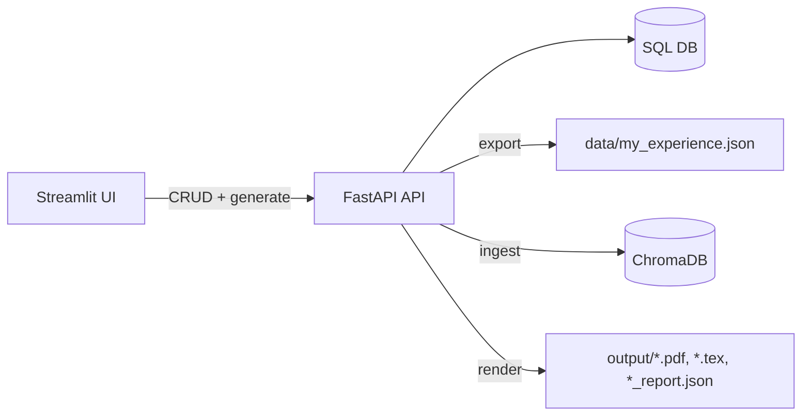
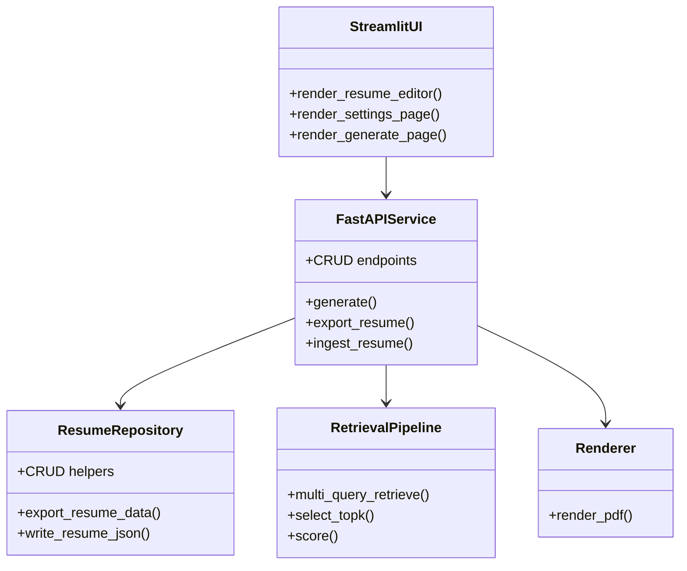
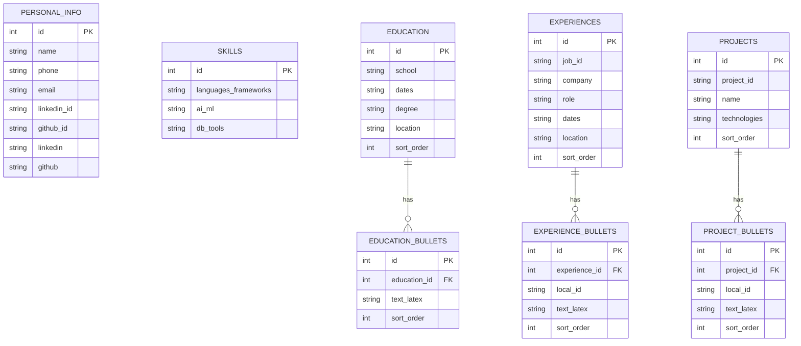

# Technical Documentation

This document covers setup, deployment, architecture, and schemas.

---

## From zero to deployed

### Prerequisites

- Docker (recommended), or Python 3.10+ with `pip`
- Internet access for the initial embedding model download (cached afterward)
- Keep `data/*.json` and `.env` private (gitignored)

### Clone and configure

```bash
git clone <your-fork-url>
cd agentic-resume-tailor
```

Create a `.env` (optional, only for secrets):

```env
OPENAI_API_KEY=YOUR_OPENAI_API_KEY
```

Edit app settings (optional):

- `config/user_settings.json` for local runs
- `config/user_settings.docker.json` for Docker Compose

### Deploy with Docker Compose (recommended)

```bash
docker compose up --build
```

Verify:

- API health: `http://localhost:8000/health`
- Streamlit UI: `http://localhost:8501`

Then:

1) Open **Resume Editor**, create your profile.
2) Click **Re-ingest ChromaDB**.
3) Open **Generate**, paste a JD, and create a tailored resume.

Stop:

```bash
docker compose down
```

### Local run (Python)

```bash
python -m venv .venv
source .venv/bin/activate
pip install -r requirements.txt

python src/server.py
streamlit run src/app.py
```

---

## System architecture



---

## Class diagram (conceptual)



---

## Database diagram



---

## Data workflow (DB-first)

- The SQL database is the source of truth (created on first launch).
- The Resume Editor writes directly to the DB via CRUD endpoints.
- Re-ingest exports the DB to `data/my_experience.json`, then ingests Chroma.
- `data/my_experience.json` is an exported artifact for inspection/backups, not the primary store.

### `bullet_id` convention

- Experience bullets: `exp:<job_id>:<bullet_local_id>`
- Project bullets: `proj:<project_id>:<bullet_local_id>`

---

## Settings and environment

Create a `.env` in the repo root (optional, for secrets only):

```env
OPENAI_API_KEY=YOUR_OPENAI_API_KEY
```

All other app settings live in `config/user_settings.json` and are edited via the Settings page.

---

## API reference (summary)

- `GET /health`
- `POST /generate`
- `GET/PUT /personal_info`
- `GET/PUT /skills`
- `GET/POST/PUT/DELETE /education`
- `GET/POST/PUT/DELETE /experiences`
- `GET/POST/PUT/DELETE /projects`
- `POST/PUT/DELETE /experiences/{job_id}/bullets`
- `POST/PUT/DELETE /projects/{project_id}/bullets`
- `POST /admin/export`
- `POST /admin/ingest`

---

## Repo layout

- `data/`
  - `raw_experience_data_example.json` - legacy JSON sample (not used by default)
  - `my_experience.json` - JSON export artifact (written on saves and ingest)
  - `processed/chroma_db/` - local ChromaDB store
  - `processed/resume.db` - SQLite CRUD store (default)
- `config/user_settings.json` - user-editable app settings (local defaults)
- `config/user_settings.docker.json` - Docker-friendly settings (api_url points to `http://api:8000`)
- `script/`
  - `convert_experience_json.py` - normalize raw data and assign stable IDs
  - `test_query.py` - manual retrieval/loop debug runner
  - `test_render.py` - render a PDF from template using sample JSON
- `config/`
  - `canonicalization.json` - alias/canonical rules
  - `families.json` - family taxonomy (generic -> satisfied_by)
- `src/`
  - `agentic_resume_tailor/` - src-layout package
    - `api/server.py` - FastAPI backend (API-only, writes artifacts + report)
    - `db/` - SQLAlchemy models + export/seed helpers for CRUD
    - `ui/app.py` - Streamlit UI (calls backend, visualizes report, downloads PDF)
    - `core/` - retrieval/selection/scoring pipeline
    - `ingest.py` - upserts bullets into Chroma using deterministic `bullet_id`
    - `jd_parser.py` - optional OpenAI JD parser (Target Profile v1)
    - `core/jd_utils.py` - shared JD parsing + fallback query helpers
    - `settings.py` - pydantic-settings config loader
    - `utils/logging.py` - log configuration helpers
  - `server.py`, `app.py`, `ingest.py` - thin wrappers for backward-compatible entrypoints
- `tests/`
  - `characterization/run_generate_characterization.py` - black-box generate test
  - `fixtures/` - characterization fixtures and expected output
  - `unit/` - fast unit tests for core modules
- `templates/resume.tex` - Jinja2 LaTeX template with `<< >>` and `((% %))` delimiters
- `output/` - generated artifacts (`<run_id>.pdf`, `<run_id>.tex`, `<run_id>_report.json`,
  `my_experience.json`)

---

## Development

Format + lint:

```bash
ruff format .
ruff check --fix .
```

Tests:

```bash
# characterization (black-box) test
python tests/characterization/run_generate_characterization.py

# update expected output if intentional behavior changes
python tests/characterization/run_generate_characterization.py --update

# unit tests
python -m unittest discover -s tests/unit
```
