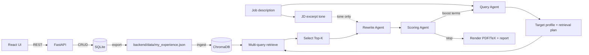

# Technical Documentation (ART)

This document describes ART's developer-facing architecture. For run commands and quickstart, see [README.md](README.md).

## System design

**Components**

- **React UI (Vite)**: Resume Editor, Settings, and Generate pages. Talks to the backend via REST.
- **FastAPI backend**: CRUD APIs, generation loop, rendering, and artifact/report output.
- **SQLite (SQLAlchemy)**: Source of truth for profile data.
- **ChromaDB**: Vector store for multi-query retrieval.
- **OpenAI (optional)**: Used by Query/Rewrite/Scoring agents when enabled.
- **Tectonic**: Renders LaTeX to PDF (optional; `skip_pdf` writes TeX only).

## DB-first contract

- The SQLite database is the authoritative source of resume data.
- The React UI performs CRUD through the API.
- `backend/data/my_experience.json` is an exported artifact for backup/inspection and for Chroma ingest.
- Rewrites in the agent loop are temporary for the run and are not written back to the DB or Chroma.

## Ingest pipeline invariants

Ingest is an explicit action and always follows this path:

```
SQLite DB -> export JSON -> Chroma ingest
```

Invariants:

- Exported JSON is the only source ingested into Chroma.
- Ingest never mutates SQLite; it only rebuilds the retrieval index.
- Commands and API usage live in `README.md`.

## Retrieval and selection internals

- The Query Agent produces a retrieval plan (3-7 dense, specific queries).
- Chroma performs multi-query retrieval with query boosts.
- Candidates are merged and scored; Top-K bullets are selected.
- Selection preserves bullet metadata (`bullet_id`, section, ordering context).

## Agent loop responsibilities (A/B/C)

This section captures responsibilities and constraints per agent.

**A) Query Agent**

- Inputs: JD text (LLM optional).
- Outputs: target profile + retrieval plan.
- Fallback: heuristic queries from JD.

**B) Rewrite Agent**

- Inputs: selected bullets, per-bullet allowlist, length constraints, and a rewrite context built from the Query Agent (target profile summary + retrieval plan, plus an optional short JD excerpt for tone).
- Constraints:
  - Rephrase only, no new facts/numbers/tools/companies.
  - Metadata unchanged; LaTeX-ready output.
  - Length target roughly 100-200 chars per bullet.
  - Invalid rewrites are reverted to original.

**C) Scoring Agent**

- Inputs: JD, target profile, skills text, original + rewritten bullets, retrieval signals.
- Outputs: final score, coverage metrics, missing keywords, boost terms.
- Signals include coverage, retrieval fit, length compliance, redundancy penalty, and quality hints.

**Loop**

- Iterate with boost terms until score >= threshold or `max_iters` is reached.

## Scoring signals (high level)

- **Retrieval score**: how well selected bullets match the retrieved candidate pool.
- **Coverage**: must-have and nice-to-have keyword coverage (bullets-only and skills+bullets).
- **Length score**: penalties for bullets outside the 100-200 char target band.
- **Redundancy**: near-duplicate bullets are penalized.
- **Quality**: quantified signal hints (e.g., metrics) used as a soft bonus.

## Report.json schema (what we store and why)

The backend writes to `backend/output/` per run:

- `<run_id>.pdf` and `<run_id>.tex` for the final tailored resume.
- `<run_id>_report.json` for explainability, debugging, and UI display.

`report.json` stores:

- Run metadata (`run_id`, `created_at`) for traceability.
- Query/target profile summary fields to explain what the system optimized for.
- Per-iteration trace (queries, selections, scoring breakdowns, rewrite audits, boost terms) to debug loop behavior.
- Rewrite conditioning details (target profile present, JD excerpt present, must-have keywords, top query plan items) for transparency.
- Final `rewritten_bullets` with validation metadata for safety checks.
- Artifact filenames so the UI can link to PDF/TeX outputs.

## Deployment notes

- Local dev uses `http://localhost:8000` for the API and `http://localhost:5173` for the UI.
- In Docker Compose, the frontend container should reach the backend at `http://api:8000`, while the browser still uses the localhost port mapping. Set `VITE_API_URL` accordingly.

## Workflow diagram (canonical)



## Migration Notes (v2 -> current)

- React UI replaces the previous UI layer.
- Agent loop adds LLM-backed Query/Rewrite/Scoring agents with strict validation.
- Legacy entrypoints and JSON-first workflows were removed; SQLite remains the source of truth.
