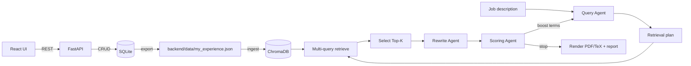

# Technical Documentation (ART)

This document describes the current architecture after the migration to React UI + FastAPI backend + the agent loop.

## Architecture overview

**Components**

- **React UI (Vite)**: Resume Editor, Settings, and Generate pages. Talks to the backend via REST.
- **FastAPI backend**: CRUD APIs, generation loop, rendering, and artifact/report output.
- **SQLite (SQLAlchemy)**: Source of truth for profile data.
- **ChromaDB**: Vector store for multi-query retrieval.
- **OpenAI (optional)**: Used by Query/Rewrite/Scoring agents when enabled.
- **Tectonic**: Renders LaTeX to PDF (optional; `skip_pdf` writes TeX only).

## DB-first contract

- The SQLite database is the authoritative source of resume data.
- The React UI performs CRUD through the API.
- `backend/data/my_experience.json` is an exported artifact for backup/inspection and for Chroma ingest.
- Rewrites in the agent loop are temporary for the run and are not written back to the DB or Chroma.

## Ingest pipeline (explicit)

Ingest is an explicit action and always follows this path:

```
SQLite DB -> export JSON -> Chroma ingest
```

Commands:

```bash
# local
cd backend
PYTHONPATH=src uv run python -m agentic_resume_tailor.ingest

# docker compose
docker compose run --rm api python -m agentic_resume_tailor.ingest
```

API endpoint:

```
POST /admin/ingest
```

## Retrieval and selection

- The Query Agent produces a retrieval plan (3-7 dense, specific queries).
- Chroma performs multi-query retrieval with query boosts.
- Candidates are merged and scored; Top-K bullets are selected.
- Selection preserves bullet metadata (`bullet_id`, section, ordering context).

## Agent loop (A/B/C)

**A) Query Agent**
- Inputs: JD text (LLM optional).
- Outputs: target profile + retrieval plan.
- Fallback: heuristic queries from JD.

**B) Rewrite Agent**
- Inputs: selected bullets, per-bullet allowlist, length constraints.
- Constraints:
  - Rephrase only, no new facts/numbers/tools/companies.
  - Metadata unchanged; LaTeX-ready output.
  - Length target roughly 100-200 chars per bullet.
- Invalid rewrites are reverted to original.

**C) Scoring Agent**
- Inputs: JD, target profile, skills text, original + rewritten bullets, retrieval signals.
- Outputs: final score, coverage metrics, missing keywords, boost terms.
- Signals include coverage, retrieval fit, length compliance, redundancy penalty, and quality hints.

**Loop**
- Iterate with boost terms until score >= threshold or `max_iters` is reached.

## Scoring signals (high level)

- **Retrieval score**: how well selected bullets match the retrieved candidate pool.
- **Coverage**: must-have and nice-to-have keyword coverage (bullets-only and skills+bullets).
- **Length score**: penalties for bullets outside the 100-200 char target band.
- **Redundancy**: near-duplicate bullets are penalized.
- **Quality**: quantified signal hints (e.g., metrics) used as a soft bonus.

## Artifacts and report.json

The backend writes to `backend/output/` per run:

- `<run_id>.pdf`
- `<run_id>.tex`
- `<run_id>_report.json`

`report.json` includes:

- `run_id`, `created_at`, `profile_used`, `target_profile_summary`
- `selected_ids` and `best_iteration_index`
- Per-iteration trace: queries used, selected IDs, scoring breakdowns, rewrite audits, boost terms
- `rewritten_bullets` with per-bullet validation metadata
- `artifacts` (pdf/tex filenames)

The UI reads the report to display scoring, missing keywords, and rewritten bullet audits.

## Deployment model

### Local dev

- Backend: `PYTHONPATH=src uv run python -m agentic_resume_tailor.api.server`
- Frontend: `npm install && npm run dev`
- UI: `http://localhost:5173`
- API: `http://localhost:8000`

### Docker Compose

- `docker compose up`
- UI: `http://localhost:5173`
- API: `http://localhost:8000`
- Frontend container should reach backend via `http://api:8000` (set `VITE_API_URL` accordingly); the browser still accesses the UI via localhost port mapping.

## Workflow diagram



## Migration Notes (v2 -> current)

- React UI replaces the previous UI layer.
- Agent loop adds LLM-backed Query/Rewrite/Scoring agents with strict validation.
- Legacy entrypoints and JSON-first workflows were removed; SQLite remains the source of truth.
