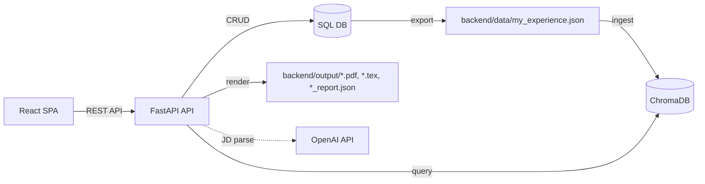
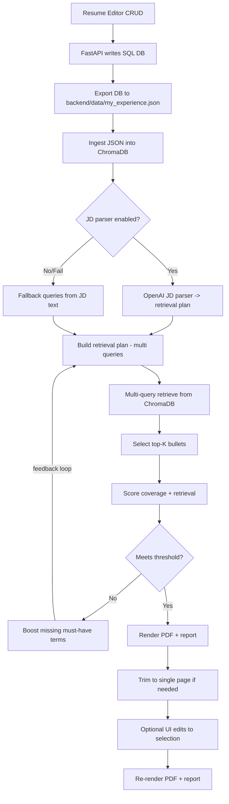
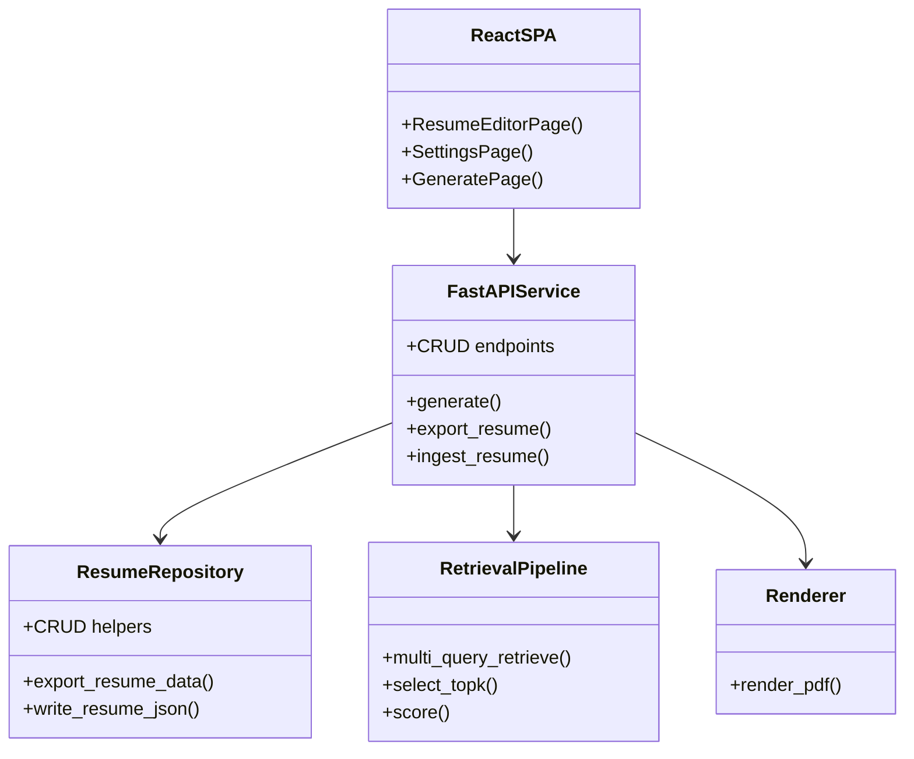
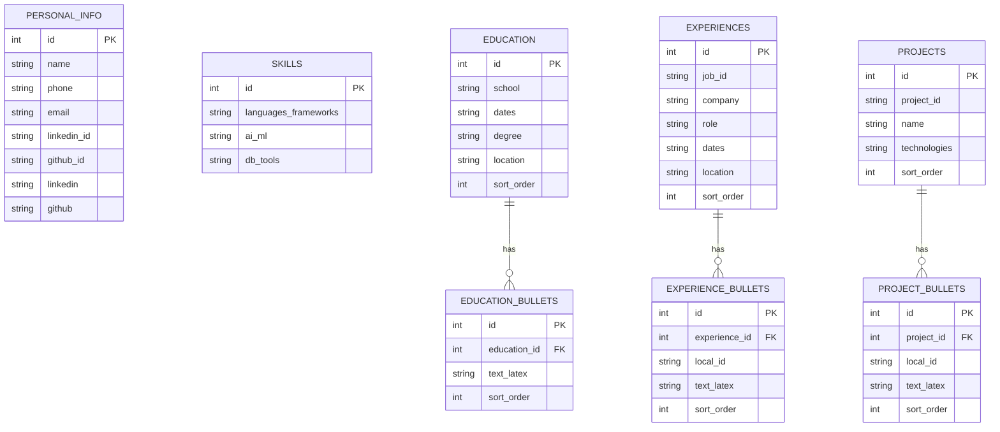

# Technical Documentation

This document covers setup, deployment, architecture, and schemas.

---

## From zero to deployed

### Prerequisites

- Docker (recommended), or Python 3.10+ with `pip`
- Node.js 20.19+ or 22.12+
- Tectonic for PDF rendering in local runs, or set `skip_pdf=true` to output TeX only
- Internet access for the initial embedding model download (cached afterward)
- OpenAI API key if `use_jd_parser` is enabled (default)
- Keep `backend/data/processed`, `backend/data/*.json`, and `backend/.env` private (gitignored)

### Clone and configure

```bash
git clone https://github.com/pinkpig777/agentic-resume-tailor.git
cd agentic-resume-tailor
```

Create a `backend/.env` (optional, only for secrets):

```env
OPENAI_API_KEY=YOUR_OPENAI_API_KEY
```

Docker Compose loads `backend/.env` into container env vars; local runs read `.env` from the
working directory or your shell environment.

Edit app settings (optional):

- `backend/config/user_settings.json` for defaults
- `backend/config/user_settings.local.json` for local runs
- `backend/config/user_settings.docker.json` for Docker Compose

### Build the Docker Image

```bash
docker build -t resume-agent ./backend
```

### Initial Chroma Ingestion

```bash
docker compose run --rm api python -m agentic_resume_tailor.ingest
```

### Deploy with Docker Compose (recommended)

```bash
docker compose up --build
```

Verify:

- API health: `http://localhost:8000/health`
- React SPA: `http://localhost:5173`

The Compose stack runs the FastAPI backend plus a Vite dev server for the frontend. The frontend
service is configured with `VITE_API_URL=http://localhost:8000`.

Then:

1. Open **Resume Editor**, create your profile.
2. Click **Re-ingest ChromaDB**.
3. Open **Generate**, paste a JD, and create a tailored resume.

Stop:

```bash
docker compose down
```

### Local run (uv)

```bash
uv venv
source .venv/bin/activate
cd backend
uv pip install -r requirements.txt

PYTHONPATH=src uv run python -m agentic_resume_tailor.api.server

# install Tectonic for PDF output, or set skip_pdf=true in settings
```

```bash
# in another terminal
cd frontend
npm install
npm run dev
```

---

## System architecture



---

## Workflow diagram



---

## Class diagram (conceptual)



---

## Database diagram



---

## Data workflow (DB-first)

- The SQL database is the source of truth (created on first launch).
- SQLite lives at `backend/data/processed/resume.db` and Chroma lives at
  `backend/data/processed/chroma_db` by default (configurable in settings).
- The Resume Editor writes directly to the DB via CRUD endpoints.
- Re-ingest exports the DB to `backend/data/my_experience.json`, then ingests Chroma.
- Only experience/project bullets are ingested into Chroma; education bullets are rendered only.
- `backend/data/my_experience.json` is an exported artifact for inspection/backups, not the primary store.

### `bullet_id` convention

- Experience bullets: `exp:<job_id>:<bullet_local_id>`
- Project bullets: `proj:<project_id>:<bullet_local_id>`

---

## Settings and environment

The API reads `OPENAI_API_KEY` from environment variables. For Docker Compose and local dev,
place it in `backend/.env` (Compose loads it), or export it in your shell. If you run the API
from the repo root, a root `.env` is also read.

```env
OPENAI_API_KEY=YOUR_OPENAI_API_KEY
```

All other app settings live in `backend/config/user_settings.json`, and the app auto-creates a
runtime override file on first start. Local runs write
`backend/config/user_settings.local.json`, while Docker/Compose writes
`backend/config/user_settings.docker.json`.
If `use_jd_parser` is false (or parsing fails), the system falls back to heuristic JD queries.
Quantitative bullet bonus tuning lives in `quant_bonus_per_hit` and `quant_bonus_cap`.
`experience_weight` biases experience bullets above projects during retrieval ranking.
`output_pdf_name` controls the download filename and writes a copy in `backend/output/`.
`skip_pdf` skips Tectonic and writes TeX plus a placeholder PDF.
`run_id` fixes output filenames for repeatable runs.
Set `USER_SETTINGS_FILE` to point at a custom settings file path.

---

## API reference (summary)

- `GET /health`
- `GET /settings`
- `PUT /settings`
- `GET /personal_info`
- `PUT /personal_info`
- `GET /skills`
- `PUT /skills`
- `GET /education`
- `POST /education`
- `PUT /education/{education_id}`
- `DELETE /education/{education_id}`
- `GET /experiences`
- `GET /experiences/{job_id}`
- `POST /experiences`
- `PUT /experiences/{job_id}`
- `DELETE /experiences/{job_id}`
- `GET /experiences/{job_id}/bullets`
- `POST /experiences/{job_id}/bullets`
- `PUT /experiences/{job_id}/bullets/{local_id}`
- `DELETE /experiences/{job_id}/bullets/{local_id}`
- `GET /projects`
- `GET /projects/{project_id}`
- `POST /projects`
- `PUT /projects/{project_id}`
- `DELETE /projects/{project_id}`
- `GET /projects/{project_id}/bullets`
- `POST /projects/{project_id}/bullets`
- `PUT /projects/{project_id}/bullets/{local_id}`
- `DELETE /projects/{project_id}/bullets/{local_id}`
- `POST /admin/export` (optional `reingest=true`)
- `POST /admin/ingest`
- `POST /generate`
- `POST /runs/{run_id}/render`
- `GET /runs/{run_id}/pdf`
- `GET /runs/{run_id}/tex`
- `GET /runs/{run_id}/report`

---

## Repo layout

- `frontend/`
  - `src/` - React SPA (Vite, Tailwind, shadcn/ui)
- `backend/`
  - `src/agentic_resume_tailor/` - FastAPI backend (API-only, writes artifacts + report)
  - `tests/` - characterization + unit tests
  - `config/` - app settings + taxonomy configs
  - `data/` - exported JSON and local DB artifacts
  - `output/` - generated artifacts (`<run_id>.pdf`, `<run_id>.tex`, `<run_id>_report.json`)
  - `templates/` - LaTeX templates
  - `script/` - debug + utility scripts

---

## Development

Format + lint:

```bash
cd backend
ruff format .
ruff check --fix .
```

Tests:

```bash
# characterization (black-box) test
RUN_CHARACTERIZATION=1 pytest -m characterization

# update expected output if intentional behavior changes
python tests/characterization/run_generate_characterization.py --update

# unit tests
pytest
```
