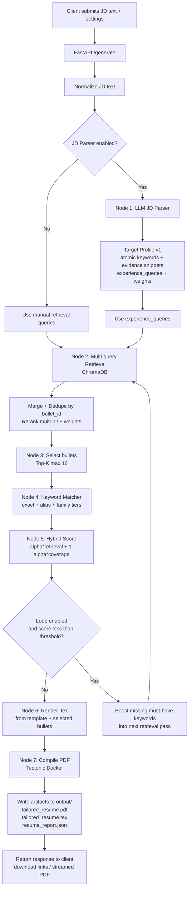

# Agentic Resume Tailor (ART)

Local, privacy-first resume tailoring agent. ART stores **only your own bullets** in a local ChromaDB vector store, retrieves the most relevant bullets for a job description (JD), and renders a **one-page** LaTeX PDF via Tectonic.

## What it does

- **Local vector store (ChromaDB)**: Embeds each bullet with `BAAI/bge-small-en-v1.5` and stores it locally.
- **Deterministic provenance**: Every bullet is stored with a stable `bullet_id` (no random UUIDs). Output always traces back to your JSON.
- **Multi-query retrieval**: Uses JD parser output (`experience_queries`) to run multiple searches, merge, dedupe by `bullet_id`, and rerank.
- **Selection**: Pure **Top-K** selection (cap: 16 bullets). (Safety Anchor is optional and currently not enforced by default.)
- **Hybrid scoring (recommended)**: Combines retrieval strength + keyword coverage (alias/family matching) to evaluate the selected set.
- **JD parser (optional)**: LLM-based parser outputs **Target Profile v1** with atomic skills + evidence snippets and a retrieval plan.
- **LaTeX rendering**: Jinja2 → `tailored_resume.tex` → Tectonic → `tailored_resume.pdf`.

## Repo map

- `data/`
  - `my_experience_v2.json` – **source of truth** (LaTeX-ready bullets + stable IDs)
  - `processed/chroma_db/` – local ChromaDB store
- `config/`
  - `canonicalization.json` – alias/canonical rules (file-driven)
- `src/`
  - `convert_experience_json.py` – converts older JSON into v2 with deterministic IDs
  - `ingest.py` – upserts bullets into Chroma using `bullet_id`
  - `jd_parser.py` – optional OpenAI JD parser (Target Profile v1)
  - `test_query.py` – CLI probe for multi-query retrieval + hybrid scoring
  - `server.py` – FastAPI app (generate artifacts)
  - `retrieval.py`, `selection.py`, `keyword_matcher.py`, `scorer.py` – pipeline modules
- `templates/resume.tex` – Jinja2-ready LaTeX template with `<< >>` and `((% %))` delimiters

## Data contract (important)

### Source of truth: `data/my_experience.json`

- Bullets are **LaTeX-ready** (`text_latex`) and are never rewritten by the system.
- The system must never invent new bullet content outside this file.

### `bullet_id` convention

- Experience bullets: `exp:<job_id>:<bullet_local_id>`
- Project bullets: `proj:<project_id>:<bullet_local_id>`

Examples:
- `exp:saturnai__ai_software_engineer:b03`
- `proj:zapmail_ai_driven_email_automation_platform:b02`

## JD Parser contract (Target Profile v1)

`script/jd_parser.py` optionally converts raw JD text into a **Target Profile v1**:

- **Atomic keywords** only (1–3 tokens)
  - ✅ `python`, `computer vision`, `fastapi`, `ruby on rails`, `sql`, `docker`, `ci/cd`
  - ❌ `python engineer`, `computer vision experience`
- Must-haves include **evidence snippets** copied verbatim from the JD text.
- Produces a retrieval plan (`experience_queries`) for multi-query retrieval.
- Canonicalization is **file-driven** via `config/canonicalization.json`.

> Note: Evidence offsets are not trusted. The parser repairs offsets server-side by locating the evidence snippet in the original JD text.

## Prerequisites

- Docker Desktop (recommended), or Python 3.10+ with `pip`
- Internet access for the initial embedding model download (cached afterwards)
- Keep `data/*.json` and `.env` private (gitignored)

## Quickstart

### 0) Build the Docker image

```bash
docker build -t resume-agent .
```

### 1) Convert your resume JSON (stable bullet IDs)

If you already have a `raw_experience_data.json`, convert it:

```bash
python script/convert_experience_json.py --input raw_experience_data.json --output my_experience.json
```

This will write a json file (example): `data/my_experience.json`.

### 2) Ingest (upsert) bullets into ChromaDB

```bash
docker run --rm \
  -v "$(pwd)/data:/app/data" \
  -v "$(pwd)/src:/app/src" \
  -v "$(pwd)/.cache_docker:/root/.cache" \
  resume-agent python src/ingest.py
```

This writes the local DB to: `data/processed/chroma_db`.

### 3) Test retrieval + hybrid scoring (CLI)

```bash
docker run --rm \
  --env-file .env \
  -v "$(pwd)/data:/app/data" \
  -v "$(pwd)/src:/app/src" \
  -v "$(pwd)/config:/app/config" \
  -v "$(pwd)/.cache_docker:/root/.cache" \
  resume-agent python src/test_query.py
```

Environment knobs:
- `ART_JD_MODEL` (default: `gpt-4.1-nano-2025-04-14`)
- `ART_CANON_CONFIG` (default: `config/canonicalization.json`)
- `ART_SCORE_ALPHA` (default: `0.7`) – hybrid weighting (retrieval vs coverage)

### 4) Run JD parser directly (optional)

```bash
docker run --rm \
  --env-file .env \
  -v "$(pwd)/data:/app/data" \
  -v "$(pwd)/src:/app/src" \
  -v "$(pwd)/config:/app/config" \
  -v "$(pwd)/.cache_docker:/root/.cache" \
  resume-agent python src/jd_parser.py
```

### 5) Start the FastAPI server

```bash
docker run --rm -p 8000:8000 \
  --env-file .env \
  -v "$(pwd)/data:/app/data" \
  -v "$(pwd)/output:/app/output" \
  -v "$(pwd)/src:/app/src" \
  -v "$(pwd)/templates:/app/templates" \
  -v "$(pwd)/config:/app/config" \
  -v "$(pwd)/.cache_docker:/root/.cache" \
  resume-agent python src/server.py
```

Then open: `http://localhost:8000`

## How it works (pipeline)

1. **Ingest**: `src/ingest.py` reads `data/my_experience_v2.json` and upserts each bullet into ChromaDB using `bullet_id`.
2. **Parse JD (optional)**: `src/jd_parser.py` produces Target Profile v1 (atomic keywords + evidence + experience queries).
3. **Retrieve (multi-query)**: `src/retrieval.py` runs multiple queries, merges results, dedupes by `bullet_id`, and reranks.
4. **Select**: `src/selection.py` keeps the top 16 bullets by reranked score.
5. **Score (hybrid)**: `src/scorer.py` combines retrieval strength + keyword coverage to evaluate the selection.
6. **Render**: Jinja2 fills `templates/resume.tex` → Tectonic compiles PDF.
7. **Artifacts**: server writes outputs into `output/`.

## Notes and limitations

- JD parser requires `OPENAI_API_KEY`. Everything else can run fully local.
- Bullets are treated as LaTeX-ready; the system does not rewrite bullet text.
- Query quality heavily affects retrieval. The JD parser is designed to produce **dense** retrieval queries to avoid generic IT matches.

## Troubleshooting

- **Embedding model download slow**: mount cache volume:
  - `-v "$(pwd)/.cache_docker:/root/.cache"`
- **Chroma has unexpected matches**: inspect with `src/test_query.py` and tune:
  - `experience_queries` density (JD parser prompt)
  - query weights / purposes in retrieval plan
  - canonicalization + family match rules
- **LaTeX error**: fix template issues or LaTeX syntax inside bullets.
- **Jinja/LaTeX collisions**: keep delimiters `<< >>`, `((% %))`.

## TODO (next)

- [ ] **C) Retrieval + Selection**
  - [ ] Implement “purpose-aware” query weighting (domain/core/deploy/etc.)
  - [ ] Improve merge + rerank strategy (combine multi-hit signals more robustly)
- [ ] **D) Keyword matching**
  - [ ] Expand family taxonomy (SQL/Cloud/Containers/ML/CV/SWE)
  - [ ] Improve controlled substring matching rules
- [ ] **E) Agentic loop**
  - [ ] Add best-effort retry loop using hybrid score threshold
  - [ ] Boost missing must-have keywords into the next retrieval pass
- [ ] **G) Explainability**
  - [ ] Write `resume_report.json` (target profile summary + selected bullets + match evidence + iteration history)


## Work Flow


