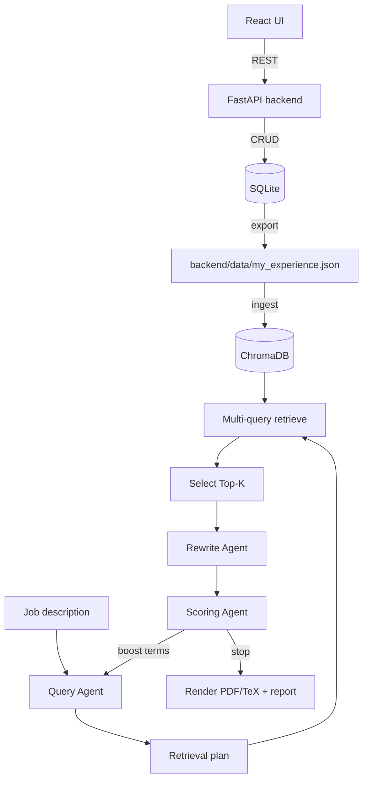

# Agentic Resume Tailor (ART)

Local-first resume tailoring system with a React (Vite) UI and a FastAPI backend. Your profile lives in a SQLite database, retrieval runs against a ChromaDB vector store (RAG-style), and the agent loop iterates Query -> Rewrite -> Score until it meets the target quality.


## What it does

- Store and edit your resume profile via DB-backed CRUD APIs used by the React UI.
- Generate a tailored single-page PDF + TeX + report.json for a job description.
- Use an agent loop to build retrieval queries, safely rewrite bullets, and score iterations.
- Keep exports as artifacts: JSON is for backup/inspection and for ingesting Chroma.

## Repo map

- `backend/`
  - `src/agentic_resume_tailor/` - FastAPI backend
  - `config/` - settings + matching configs
  - `data/` - exported JSON + SQLite DB
  - `output/` - generated artifacts (`<run_id>.pdf`, `.tex`, `_report.json`)
  - `templates/` - LaTeX templates
  - `tests/` - unit + characterization tests
- `frontend/`
  - `src/` - React SPA (Vite)

## Quickstart

### Local development

Backend:

```bash
cd backend
uv venv
source .venv/bin/activate
uv pip install -r requirements.txt
PYTHONPATH=src uv run python -m agentic_resume_tailor.api.server
```

Frontend:

```bash
cd frontend
npm install
npm run dev
```

- UI: `http://localhost:5173`
- API: `http://localhost:8000`
- The UI calls the API using `VITE_API_URL` (defaults to `http://localhost:8000`).
- If you enable LLM agents, set `OPENAI_API_KEY` in `backend/.env` or your shell.

### Docker Compose (backend + frontend)

```bash
docker compose up
```

- UI: `http://localhost:5173`
- API: `http://localhost:8000`
- In Compose, the frontend container should reach the backend at `http://api:8000` (set `VITE_API_URL` accordingly). The browser still accesses the UI via the localhost port mapping.

### Ingest / re-ingest (explicit)

Ingest exports DB -> JSON -> Chroma. Run this after you edit profile data.

CLI (local):

```bash
cd backend
PYTHONPATH=src uv run python -m agentic_resume_tailor.ingest
```

Docker Compose:

```bash
docker compose run --rm api python -m agentic_resume_tailor.ingest
```

You can also call the API endpoint:

```bash
curl -X POST http://localhost:8000/admin/ingest
```

## API overview

- `GET /health`
- `GET /settings`, `PUT /settings`
- CRUD endpoints: `/personal_info`, `/skills`, `/education`, `/experiences`, `/projects`
- `POST /admin/export` (optional `reingest=true`)
- `POST /admin/ingest`
- `POST /generate`
- `POST /runs/{run_id}/render`
- `GET /runs/{run_id}/pdf`, `/tex`, `/report`

## Agent loop (high level)

1. Query Agent builds a target profile + retrieval plan from the JD (LLM optional).
2. Chroma multi-query retrieval + Top-K selection.
3. Rewrite Agent lightly rephrases selected bullets (no new facts, numbers, tools, or metadata; LaTeX-ready).
4. Scoring Agent evaluates coverage, retrieval, length targets (roughly 100-200 chars), redundancy, and quality signals.
5. Boost missing must-haves and repeat until threshold or max iterations.

## Troubleshooting

- UI cannot reach API: confirm `VITE_API_URL` and CORS in `/settings`.
- "0 records in Chroma": run ingest to rebuild the vector store.
- PDF/TeX issues: install Tectonic or set `skip_pdf=true` in settings.

## Tests

```bash
cd backend
uv run pytest
```

## Workflow



## Migration Notes (v2 -> current)

- React UI replaces the previous UI layer.
- Agent loop (Query -> Rewrite -> Score) replaces heuristic-only loops.
- Legacy entrypoints and JSON-first scripts were removed; SQLite is the source of truth.
