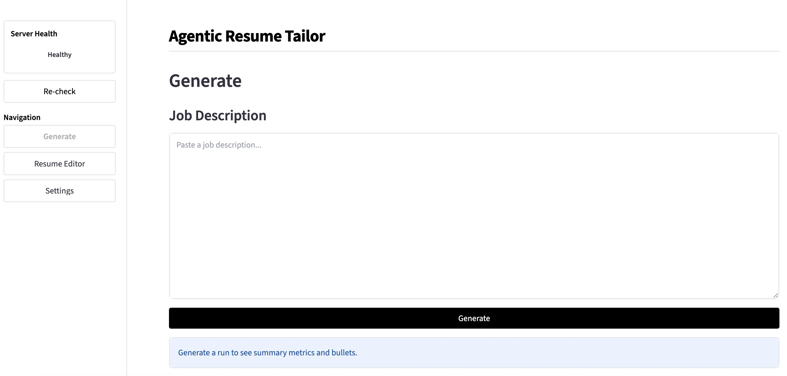

# Agentic Resume Tailor (ART)

Local, privacy-first resume tailoring agent. ART keeps your profile on disk, stores bullets in a local ChromaDB vector store, retrieves the most relevant bullets for a job description (JD), and renders a single-page LaTeX PDF via Tectonic.

This repo has two runtimes:

- FastAPI backend (`backend/`): API endpoints, agent loop, rendering, artifact/report generation.
- React SPA (`frontend/`): Vite + React UI for Generate, Resume Editor, and Settings pages.

---



## Highlights

- 🚀 Generate a single-page PDF and LaTeX source from any JD.
- 🗃️ Edit your profile end-to-end with DB-backed CRUD (personal info, education, experiences, projects).
- 🔁 Agentic loop boosts missing must-have keywords and blends retrieval + coverage scores.
- 🧾 Explainability reports show selected IDs, scores, and keyword evidence.
- 🔄 One-click export and re-ingest keeps Chroma in sync.

## User Guide

This guide covers day-to-day usage. For setup and deployment, see `ARCHITECTURE.md`.

### 1) Open the app

- React UI: `http://localhost:5173`
- API health: `http://localhost:8000/health`

### 2) Build your profile (Resume Editor)

1. Open **Resume Editor** in the sidebar.
2. Fill out **Personal Info** and **Skills**.
3. Add **Education**, **Work Experience**, and **Projects**.
4. Add bullets under each experience/project.
5. Click **Re-ingest ChromaDB** to refresh retrieval after edits.

Notes:

- Bullet IDs are stable (e.g., `b01`, `b02`) and never renumbered.
- Bullet text is LaTeX-ready; the system does not rewrite it.

### 3) Adjust defaults (Settings)

- Open **Settings** to change default generation and ingest behavior.
- Settings are loaded from `backend/config/user_settings.json`, then a runtime-specific override file is
  auto-created on first start and used for saves:
  - `backend/config/user_settings.local.json` for local runs
  - `backend/config/user_settings.docker.json` for Docker/Compose runs
- If you enable **Auto re-ingest on save**, the vector store refreshes after each edit.
- Use **Advanced tuning** to adjust the quantitative bullet bonus (per-hit and cap).
- The JD parser model is selected from a dropdown of current OpenAI models (or override in
  `backend/config/user_settings.json`).

### 4) Generate a tailored resume (Generate)

1. Open **Generate**.
2. Paste a JD and click **Generate**.
3. Review the report, adjust selection, and re-render if needed.
4. Download the PDF, TeX, and report JSON.

Outputs:

- PDF: `backend/output/<run_id>.pdf` (generated by the backend)
- TeX: `backend/output/<run_id>.tex`
- Report: `backend/output/<run_id>_report.json`

Temporary edits (Generate):

- Use **Selected bullets** to add/edit/remove bullets for this run only.
- Temporary bullets are LaTeX-ready and can attach to existing experiences/projects.
- Temporary edits do not touch the SQL DB, exported JSON, or Chroma ingest.
- The report captures `temp_additions`, `temp_edits`, and `temp_removals` for the run.

### 5) Exported JSON artifact

- `backend/data/my_experience.json` is an exported artifact (for backup/inspection).
- The SQL database remains the source of truth.

---

## Need setup details?

See `ARCHITECTURE.md` for deployment steps, system diagrams, DB schema, and API details.

Template tip: create `backend/templates/resume.local.tex` to override the default
`backend/templates/resume.tex`
without committing your personal edits.

---

## Docker (full stack)

```bash
docker compose up --build
```

- Frontend: `http://localhost:5173`
- Backend: `http://localhost:8000/health`

---

## Local development (uv)

```bash
uv venv
source .venv/bin/activate
cd backend
uv pip install -r requirements.txt

# run unit tests
uv run pytest

# run the API
PYTHONPATH=src uv run python -m agentic_resume_tailor.api.server

# run the UI (separate terminal)
cd frontend
# requires Node.js 20.19+ or 22.12+ for Vite 7
npm install
npm run dev
```

## Frontend tooling notes

- Vite uses `@vitejs/plugin-react` (Babel-based Fast Refresh) by default; swap to the SWC
  plugin if you want faster refresh times.
- The React Compiler is not enabled in this setup; add it only if you want the compiler
  tradeoffs in dev/build.
- For stricter linting, enable type-aware rules in `frontend/eslint.config.js` and include
  the `tsconfig.app.json`/`tsconfig.node.json` projects; optional add-ons include
  `eslint-plugin-react-x` and `eslint-plugin-react-dom`.
