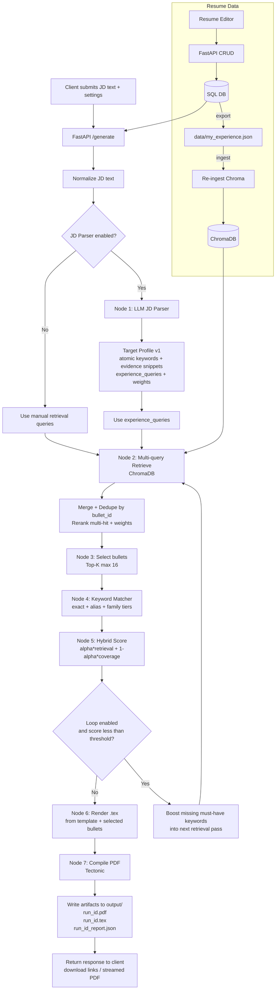

# Agentic Resume Tailor (ART)

Local, privacy-first resume tailoring agent. ART keeps your data on disk, stores bullets in a local ChromaDB vector store, retrieves the most relevant bullets for a job description (JD), and renders a single-page LaTeX PDF via Tectonic.

This repo has two runtimes:

- FastAPI backend (`src/server.py`): API endpoints, agent loop, rendering, artifact/report generation.
- Streamlit UI (`src/app.py`): Generate, Resume Editor, and Settings pages.

---

## Typical workflow

1) Open **Resume Editor**, add your profile (personal info, skills, education, experiences/projects, bullets).
2) Click **Re-ingest ChromaDB** to rebuild the vector store from the DB.
3) Open **Generate**, paste a JD, and create a tailored resume.

---

## Highlights

- DB-first profile storage with CRUD UI.
- Stable, deterministic `bullet_id` for every bullet.
- Multi-query retrieval with reranking and hybrid scoring.
- Agentic loop to boost missing must-have keywords.
- LaTeX rendering to a single-page PDF.
- Settings page saves app defaults to `config/user_settings.json`.

---

## Pipeline details

- Local vector store (ChromaDB): embeds each bullet with `BAAI/bge-small-en-v1.5`.
- Multi-query retrieval: uses JD parser output (`experience_queries`) or fallback queries, merges + dedupes by `bullet_id`, then reranks.
- Top-K selection: keeps the best `N` bullets (default `16`).
- Keyword matching: canonicalization + family rules for explainable coverage scoring.
- Hybrid scoring: blends retrieval strength and keyword coverage each iteration.
- Quant bonus: small bounded boost for quantified results.
- Within-experience ordering: sorts selected bullets inside each job/project by relevance (ties by bullet id).
- Report: writes `output/<run_id>_report.json` with queries used, selected IDs, missing keywords, scores, and iteration history.

---

## UI pages

- **Generate**: paste a JD and run the agent using saved defaults.
- **Resume Editor**: CRUD personal info, skills, education, experiences/projects, and bullets; re-ingest Chroma.
- **Settings**: edit app defaults for generation and ingest; saved to `config/user_settings.json`.

---

## Data workflow (DB-first)

- The SQL database is the source of truth (created on first launch).
- The Resume Editor writes directly to the DB via CRUD endpoints.
- Re-ingest exports the DB to `data/my_experience.json`, then ingests Chroma.
- `data/my_experience.json` is an exported artifact for inspection/backups, not the primary store.

### Export format (`my_experience.json`)

```json
{ "id": "b01", "text_latex": "..." }
```

Notes:
- Use `$|$` inside `role` to separate primary title from team/focus. The primary title is used to create a stable `job_id`.
- Bullets are LaTeX-ready and are never rewritten by the system.
- The template expects `personal_info`, `skills`, `education`, `experiences`, and `projects` to exist (use empty lists when needed).

### `bullet_id` convention

- Experience bullets: `exp:<job_id>:<bullet_local_id>`
- Project bullets: `proj:<project_id>:<bullet_local_id>`

Examples:

- `exp:saturnai__ai_software_engineer:b03`
- `proj:zapmail_ai_driven_email_automation_platform:b02`

### Legacy JSON tools (optional)

`script/convert_experience_json.py` still exists to normalize old JSON, but the app does not auto-import JSON on startup.

---

## Settings and environment

Create a `.env` in the repo root (optional, for secrets only):

```env
OPENAI_API_KEY=YOUR_OPENAI_API_KEY
```

The app reads `OPENAI_API_KEY` from `.env` or the process environment. All other app settings live in
`config/user_settings.json` and are edited via the Settings page.

Example settings:

```json
{
  "db_path": "data/processed/chroma_db",
  "sql_db_url": "sqlite:///data/processed/resume.db",
  "export_file": "data/my_experience.json",
  "auto_reingest_on_save": false,
  "template_dir": "templates",
  "output_dir": "output",
  "collection_name": "resume_experience",
  "embed_model": "BAAI/bge-small-en-v1.5",
  "use_jd_parser": true,
  "max_bullets": 16,
  "per_query_k": 10,
  "final_k": 30,
  "max_iters": 3,
  "threshold": 80,
  "alpha": 0.7,
  "must_weight": 0.8,
  "boost_weight": 1.6,
  "boost_top_n_missing": 6,
  "cors_origins": "*",
  "skip_pdf": false,
  "run_id": null,
  "jd_model": "gpt-4.1-nano-2025-04-14",
  "canon_config": "config/canonicalization.json",
  "family_config": "config/families.json",
  "api_url": "http://localhost:8000",
  "log_level": "INFO",
  "log_json": false,
  "port": 8000
}
```

---

## Run the app

### Prerequisites

- Docker, or Python 3.10+ with `pip`
- Internet access for the initial embedding model download (cached afterwards)
- Keep `data/*.json` and `.env` private (gitignored)

### Docker Compose (recommended)

```bash
docker compose up --build
```

Open:

- API health: `http://localhost:8000/health`
- Streamlit UI: `http://localhost:8501`

Then open **Resume Editor**, create your profile, and click **Re-ingest ChromaDB**.

Note: Compose uses `config/user_settings.docker.json`. Edit that file to change settings.

Stop:

```bash
docker compose down
```

### Docker (no Compose)

Build:

```bash
docker build -t resume-agent .
```

Run the API:

```bash
docker run --rm -p 8000:8000 \
  --env-file .env \
  -v "$(pwd)/data:/app/data" \
  -v "$(pwd)/output:/app/output" \
  -v "$(pwd)/src:/app/src" \
  -v "$(pwd)/templates:/app/templates" \
  -v "$(pwd)/config:/app/config" \
  -v "$(pwd)/.cache_docker:/root/.cache" \
  resume-agent python src/server.py
```

Run the UI:

```bash
docker run --rm -p 8501:8501 \
  --env-file .env \
  -v "$(pwd)/src:/app/src" \
  resume-agent streamlit run /app/src/app.py --server.address=0.0.0.0 --server.port=8501
```

Open Streamlit: `http://localhost:8501`

### Local run (Python)

```bash
python -m venv .venv
source .venv/bin/activate
pip install -r requirements.txt

# Example settings are shown in the Settings section above.

python src/server.py
streamlit run src/app.py
```

Note: Tectonic must be installed on your machine to render PDFs locally.

---

## API usage

### `GET /health`

Returns status JSON used by UI and Compose healthchecks.

### `POST /generate`

Input: JD text + settings (max bullets, loop knobs, scoring weights).  
Output: `run_id` + URLs for artifacts (PDF / TEX / report).

Example:

```bash
curl -sS http://localhost:8000/generate \
  -H "Content-Type: application/json" \
  -d '{
    "jd_text": "Paste job description here",
    "max_bullets": 16,
    "max_iters": 3
  }'
```

Artifacts are written under `output/` and exposed via:

- `/runs/{run_id}/pdf`
- `/runs/{run_id}/tex`
- `/runs/{run_id}/report`

### Resume CRUD

- `GET /experiences`, `GET /projects`
- `POST /experiences`, `POST /projects`
- `PUT /experiences/{job_id}`, `PUT /projects/{project_id}`
- `DELETE /experiences/{job_id}`, `DELETE /projects/{project_id}`
- `POST /experiences/{job_id}/bullets`, `PUT /experiences/{job_id}/bullets/{local_id}`,
  `DELETE /experiences/{job_id}/bullets/{local_id}`
- `POST /projects/{project_id}/bullets`, `PUT /projects/{project_id}/bullets/{local_id}`,
  `DELETE /projects/{project_id}/bullets/{local_id}`

### Admin operations

- `POST /admin/export` regenerates `data/my_experience.json` from the DB.
- `POST /admin/ingest` exports `data/my_experience.json` and re-ingests Chroma (returns counts + elapsed time).

---

## Database schema (SQLite/Postgres)

Tables and relations (SQLAlchemy models in `src/agentic_resume_tailor/db/models.py`):

- `personal_info` (single row)
  - `id` (PK), `name`, `phone`, `email`, `linkedin_id`, `github_id`, `linkedin`, `github`
- `skills` (single row)
  - `id` (PK), `languages_frameworks`, `ai_ml`, `db_tools`
- `education`
  - `id` (PK), `school`, `dates`, `degree`, `location`, `sort_order`
- `education_bullets`
  - `id` (PK), `education_id` (FK -> `education.id`), `text_latex`, `sort_order`
- `experiences`
  - `id` (PK), `job_id` (unique), `company`, `role`, `dates`, `location`, `sort_order`
- `experience_bullets`
  - `id` (PK), `experience_id` (FK -> `experiences.id`), `local_id` (`b01`...), `text_latex`,
    `sort_order`
  - unique constraint: (`experience_id`, `local_id`)
- `projects`
  - `id` (PK), `project_id` (unique), `name`, `technologies`, `sort_order`
- `project_bullets`
  - `id` (PK), `project_id` (FK -> `projects.id`), `local_id` (`b01`...), `text_latex`,
    `sort_order`
  - unique constraint: (`project_id`, `local_id`)

Notes:
- `job_id` and `project_id` are deterministic slugs; bullet `local_id` is stable and never derived from text.
- Ordering is controlled by `sort_order`; deletes never renumber IDs.

---

## Repo map

- `data/`
  - `raw_experience_data_example.json` - legacy JSON sample (not used by default)
  - `my_experience.json` - JSON export artifact (written on saves and ingest)
  - `processed/chroma_db/` - local ChromaDB store
  - `processed/resume.db` - SQLite CRUD store (default)
- `config/user_settings.json` - user-editable app settings (local defaults)
- `config/user_settings.docker.json` - Docker-friendly settings (api_url points to `http://api:8000`)
- `script/`
  - `convert_experience_json.py` - normalize raw data and assign stable IDs
  - `test_query.py` - manual retrieval/loop debug runner
  - `test_render.py` - render a PDF from template using sample JSON
- `config/`
  - `canonicalization.json` - alias/canonical rules
  - `families.json` - family taxonomy (generic -> satisfied_by)
- `src/`
  - `agentic_resume_tailor/` - src-layout package
    - `api/server.py` - FastAPI backend (API-only, writes artifacts + report)
    - `db/` - SQLAlchemy models + export/seed helpers for CRUD
    - `ui/app.py` - Streamlit UI (calls backend, visualizes report, downloads PDF)
    - `core/` - retrieval/selection/scoring pipeline
    - `ingest.py` - upserts bullets into Chroma using deterministic `bullet_id`
    - `jd_parser.py` - optional OpenAI JD parser (Target Profile v1)
    - `core/jd_utils.py` - shared JD parsing + fallback query helpers
    - `settings.py` - pydantic-settings config loader
    - `utils/logging.py` - log configuration helpers
  - `server.py`, `app.py`, `ingest.py` - thin wrappers for backward-compatible entrypoints
- `tests/`
  - `characterization/run_generate_characterization.py` - black-box generate test
  - `fixtures/` - characterization fixtures and expected output
  - `unit/` - fast unit tests for core modules
- `templates/resume.tex` - Jinja2 LaTeX template with `<< >>` and `((% %))` delimiters
- `output/` - generated artifacts (`<run_id>.pdf`, `<run_id>.tex`, `<run_id>_report.json`,
  `my_experience.json`)

---

## Workflow diagram



---

## Development

Format + lint:

```bash
ruff format .
ruff check --fix .
```

Tests:

```bash
# characterization (black-box) test
python tests/characterization/run_generate_characterization.py

# update expected output if intentional behavior changes
python tests/characterization/run_generate_characterization.py --update

# unit tests
python -m unittest discover -s tests/unit
```

---

## Troubleshooting

### "Collection does not exist" or 0 records

Ensure you have profile data in the DB, then run ingest:

```bash
python src/ingest.py
```

Or via API (exports from DB first):

```bash
curl -sS -X POST http://localhost:8000/admin/ingest
```

Docker Compose:

```bash
docker compose run --rm api python /app/src/ingest.py
```

### Streamlit cannot connect to API

- Streamlit inside Docker must call the API by service name: `http://api:8000` (Compose sets this).
- Streamlit outside Docker should call `http://localhost:8000`.

### UI loads but `/health` fails in Compose

The Compose healthcheck uses a Python urllib command. If you replace it with `curl`, install curl in the image.
