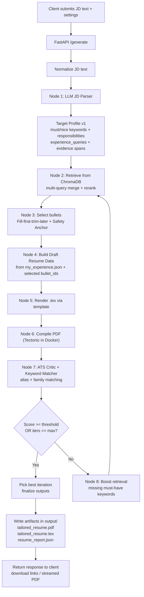

# AI Resume Agent

Local, privacy-first AI agent that tailors your resume to a job description using ChromaDB vector search, a one-page bullet selection algorithm, and LaTeX/Tectonic rendering.

## What it does

- Embeds your experience bullets with `all-MiniLM-L6-v2` and stores them in a local ChromaDB collection.
- Scores every bullet against a pasted JD, keeps the most relevant set (cap: 16 bullets), and forces inclusion of the most recent job if it would otherwise drop.
- Renders a Jinja2/LaTeX template with custom delimiters to avoid Jinja-LaTeX collisions.
- Exposes a FastAPI server for a browser flow; includes CLI utilities for ingestion and testing.

## Repo map

- `data/` – your resume data lives in `my_experience.json`; `processed/` holds the ChromaDB store.
- `src/ingest.py` – loads `data/my_experience.json` into ChromaDB.
- `src/test_query.py` – quick CLI probe to inspect the vector store.
- `src/jd_parser.py` – optional OpenAI JD parser (`OPENAI_API_KEY` required).
- `src/test_render.py` – renders a PDF to `output/temp_resume.pdf` using `templates/resume.tex`.
- `src/server.py` – FastAPI app that scores bullets, applies the trimming logic, and renders PDFs with Tectonic.
- `templates/resume.tex` – Jinja2-ready LaTeX template with `<< >>` and `((% %))` delimiters.

## Prerequisites

- Docker Desktop (running) or Python 3.10+ with `pip`.
- Tectonic CLI if rendering outside Docker.
- Keep `data/my_experience.json` and `.env` private (both are gitignored).

## Quickstart

1. Prepare data: fill out `data/my_experience.json` with your personal info, skills, education, experiences, and projects.
   You can find the template and create your own json.

2. Build the Docker image:

```bash
docker build -t resume-agent .
```

3. Ingest data into ChromaDB:

```bash
docker run --rm \
  -v $(pwd)/data:/app/data \
  -v $(pwd)/src:/app/src \
  resume-agent python src/ingest.py
```

3.1 Run query test:

```bash
docker run --rm \
  --env-file .env \
  -v "$(pwd)/data:/app/data" \
  -v "$(pwd)/src:/app/src" \
  -v "$(pwd)/.cache_docker:/root/.cache" \
  resume-agent python src/test_query.py
```

3.2 Run jd_parser:

```bash
docker run --rm \
  --env-file .env \
  -v $(pwd)/data:/app/data \
  -v $(pwd)/src:/app/src \
  -v $(pwd)/config:/app/config \
  resume-agent python src/jd_parser.py
```

This writes embedded bullets to `data/processed/chroma_db`.

4. Start the FastAPI agent:

```bash
docker run --rm -p 8000:8000 \
  --env-file .env \
  -v $(pwd)/data:/app/data \
  -v $(pwd)/output:/app/output \
  -v $(pwd)/src:/app/src \
  -v $(pwd)/templates:/app/templates \
  -v $(pwd)/.cache_docker:/root/.cache \
  resume-agent python src/server.py
```

Then open `http://localhost:8000`, paste a JD, and download the generated PDF.

## How it works

1. Ingest: `src/ingest.py` reads `data/my_experience.json`, embeds bullets, and stores them in ChromaDB.
2. Scoring: `src/server.py` queries ChromaDB with the JD, converts distances to scores, and aggregates all bullets.
3. Selection: if total bullets ≤16, keep all; otherwise, sort by score and keep the top 16.
4. Reconstruction: rebuild experiences/projects with surviving bullets; if the most recent job would be dropped, force it back with at least one bullet.
5. Rendering: built-in `render_pdf` compiles the LaTeX template to a PDF in `output/`.

## Notes and limitations

- `src/jd_parser.py` requires `OPENAI_API_KEY`; other flows run locally without external APIs.
- The LaTeX template uses custom delimiters (`<< >>`, `((% %))`); keep them to avoid Jinja/LaTeX conflicts.

## Troubleshooting

- Missing Tectonic locally: install from https://tectonic-typesetting.github.io or run via Docker.
- Embedding model download issues: ensure initial internet access; subsequent runs use the cached model (the `.cache_docker` volume speeds this up).
- “Undefined control sequence \titrule”: fix the template to `\titlerule`.
- Jinja/LaTeX collisions: ensure the custom delimiters remain set in the renderer.

### TODO

- [ ] AI JD Parser Contract
- [ ] Multi-query Retrieval
- [ ] Agentic ATS Critic
- [ ] Agentic Loop Control

## System Architecture Summary

### Core components

#### Client (UI/CLI)

- Sends JD text and optional settings.
- Receives the generated artifacts: PDF, TEX, JSON report.

#### ART API Server (FastAPI Orchestrator)

- Owns pipeline orchestration, persistence paths, and artifact outputs.
- Exposes endpoints:
  - `POST /ingest` (rebuild vector DB from `my_experience.json`)
  - `POST /generate` (run tailoring workflow)
  - `GET /health`

#### Source of Truth: `my_experience.json`

- Stores LaTeX-ready bullets and structured resume data.
- The system must never invent bullet content outside this file.

#### Vector Store: Local ChromaDB

- Contains one record per bullet with a stable `bullet_id` (deterministic).
- Stores embeddings + metadata (source_job, section, dates, tags).

#### LLM JD Parser (Node 1)

- Converts raw JD text into a structured Target Profile (schema v1).
- Outputs:
  - must-have keywords
  - nice-to-have keywords
  - responsibilities
  - domain terms
  - retrieval queries
  - evidence spans

#### Retrieval + Selection Engine

- Retrieval: runs multiple queries (`experience_queries`) against ChromaDB, then merges and reranks results.
- Selection: “fill first, trim later” with a Safety Anchor (most recent job retained).

#### ATS Critic + Keyword Matcher

- Keyword matching supports:
  - exact match
  - alias match
  - family match (example: `sql` satisfied by `postgresql`)
- Critic computes score (0–100) using the rubric:
  - must-have coverage (0–70)
  - nice-to-have coverage (0–25)
  - distribution bonus (0–5)
- Produces:
  - `ats_score`
  - `missing_keywords` (canonical)
  - match evidence

#### Agentic Loop Controller

- Runs best-effort self-correction:
  - If score < threshold (default 80): retry retrieval with boosted missing keywords
  - Max 3 iterations
- Always returns a PDF, even if score remains low.
- Returns the best scoring iteration.

#### Renderer

- Jinja2 template → `tailored_resume.tex`
- Tectonic (Docker) → `tailored_resume.pdf`

#### Explainability Reporter

- Writes `resume_report.json` containing:
  - target profile summary
  - final score + iterations
  - selected bullets with `bullet_id` provenance
  - per-iteration history including query boosts


