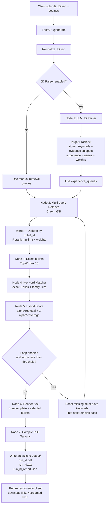

# Agentic Resume Tailor (ART)

Local, privacy-first resume tailoring agent. ART stores only your own bullets in a local ChromaDB vector store, retrieves the most relevant bullets for a job description (JD), and renders a single-page LaTeX PDF via Tectonic.

This repo supports two runtimes:

- FastAPI backend (`src/server.py`): API endpoints, agent loop, rendering, artifact/report generation.
- Streamlit UI (`src/app.py`): frontend that calls the API and visualizes the report.

---

## What it does

- Local vector store (ChromaDB): embeds each bullet with `BAAI/bge-small-en-v1.5`.
- Deterministic provenance: each bullet is stored with a stable `bullet_id`.
- Multi-query retrieval: uses JD parser output (`experience_queries`) or fallback queries, merges + dedupes by `bullet_id`, then reranks.
- Selection (Top-K): selects the top `N` bullets (default `16`).
- Agentic loop: iteratively boosts missing must-have keywords into the next retrieval pass (no OpenAI needed for boosting).
- Keyword matching: canonicalization + family matching for explainability and coverage scoring.
- Hybrid scoring: blends retrieval strength + keyword coverage per iteration.
- Quant bonus: adds a small, bounded boost for bullets with quantitative results.
- Within-experience ordering: sorts selected bullets inside each job/project by relevance (ties by bullet id).
- LaTeX rendering: Jinja2 -> `.tex` -> Tectonic -> `.pdf`.
- Report: writes `output/<run_id>_report.json` with queries used, selected bullet IDs, missing keywords, scores, and iteration history.

---

## Repo map

- `data/`
  - `raw_experience_data_example.json` - template for your raw data (editable)
  - `my_experience.json` - pipeline input (exported from DB if using CRUD)
  - `processed/chroma_db/` - local ChromaDB store
  - `processed/resume.db` - SQLite CRUD store (default)
- `script/`
  - `convert_experience_json.py` - normalize raw data and assign stable IDs
  - `test_query.py` - manual retrieval/loop debug runner
  - `test_render.py` - render a PDF from template using sample JSON
- `config/`
  - `canonicalization.json` - alias/canonical rules
  - `families.json` - family taxonomy (generic -> satisfied_by)
- `src/`
  - `agentic_resume_tailor/` - src-layout package
    - `api/server.py` - FastAPI backend (API-only, writes artifacts + report)
    - `db/` - SQLAlchemy models + export/seed helpers for CRUD
    - `ui/app.py` - Streamlit UI (calls backend, visualizes report, downloads PDF)
    - `core/` - retrieval/selection/scoring pipeline
    - `ingest.py` - upserts bullets into Chroma using deterministic `bullet_id`
    - `jd_parser.py` - optional OpenAI JD parser (Target Profile v1)
    - `core/jd_utils.py` - shared JD parsing + fallback query helpers
    - `settings.py` - pydantic-settings config loader
    - `utils/logging.py` - log configuration helpers
  - `server.py`, `app.py`, `ingest.py` - thin wrappers for backward-compatible entrypoints
- `tests/`
  - `characterization/run_generate_characterization.py` - black-box generate test
  - `fixtures/` - characterization fixtures and expected output
  - `unit/` - fast unit tests for core modules
- `templates/resume.tex` - Jinja2 LaTeX template with `<< >>` and `((% %))` delimiters
- `output/` - generated artifacts (`<run_id>.pdf`, `<run_id>.tex`, `<run_id>_report.json`)

---

## Data contract (important)

### 1) Raw input format (easy to edit)

Start from `data/raw_experience_data_example.json`, copy it, and edit:

```bash
cp data/raw_experience_data_example.json data/raw_experience_data.json
```

Minimal shape (see the example file for full fields):

```json
{
  "personal_info": {
    "name": "Firstname Lastname",
    "phone": "(123)-456-7890",
    "email": "email@example.com",
    "linkedin_id": "linkedin-handle",
    "github_id": "github-handle"
  },
  "skills": {
    "languages_frameworks": "Python, FastAPI, React",
    "ai_ml": "PyTorch, Transformers",
    "db_tools": "PostgreSQL, Redis, Docker"
  },
  "education": [
    {
      "school": "University Name",
      "dates": "Start Date -- End Date",
      "degree": "Degree Name",
      "location": "City, State",
      "bullets": []
    }
  ],
  "experiences": [
    {
      "company": "Company Name",
      "role": "Job Title $|$ Team or Focus",
      "dates": "Start Date -- End Date",
      "location": "City, Country",
      "bullets": [
        "LaTeX-ready bullet text with \\textbf{metrics}"
      ]
    }
  ],
  "projects": [
    {
      "name": "Project Name",
      "technologies": "Tech A, Tech B",
      "bullets": [
        "Project bullet in LaTeX-ready format"
      ]
    }
  ]
}
```

Notes:
- Use `$|$` inside `role` to separate primary title from team/focus. The script uses the primary title to create a stable `job_id`.
- Bullets are LaTeX-ready and are never rewritten by the system.
- The template expects `personal_info`, `skills`, `education`, `experiences`, and `projects` to exist (use empty lists when needed).

### 2) Normalize to `data/my_experience.json` (pipeline input)

Run the converter (adds `job_id`, `project_id`, and bullet IDs):

```bash
python script/convert_experience_json.py \
  --input data/raw_experience_data.json \
  --output data/my_experience.json
```

The normalized file stores bullets as objects:

```json
{ "id": "b01", "text_latex": "..." }
```

The system only ever selects from this file; it never invents new bullets.
If you want IDs to remain stable after editing bullet text, edit `data/my_experience.json` directly and keep the existing `id` fields.
If you use the CRUD API, the SQL database is the source of truth and `POST /admin/export` regenerates this file.

### `bullet_id` convention

- Experience bullets: `exp:<job_id>:<bullet_local_id>`
- Project bullets: `proj:<project_id>:<bullet_local_id>`

Examples:

- `exp:saturnai__ai_software_engineer:b03`
- `proj:zapmail_ai_driven_email_automation_platform:b02`

---

## Database-backed CRUD (optional)

- The API seeds the resume DB from `data/my_experience.json` if the SQL DB is empty.
- CRUD endpoints are available at `/personal_info`, `/skills`, `/experiences`, `/projects`, and `/education`.
- After edits, call `POST /admin/export` to regenerate `data/my_experience.json` (add `?reingest=1` to rebuild Chroma).

---

## Environment

Create a `.env` in the repo root (used by Docker and optional for local runs):

```env
OPENAI_API_KEY=YOUR_OPENAI_API_KEY

# Keyword matching configs
ART_CANON_CONFIG=config/canonicalization.json
ART_FAMILY_CONFIG=config/families.json

# Streamlit UI: use localhost when running outside Docker
ART_API_URL=http://localhost:8000
```

If you run locally, load `.env` with `python -m dotenv run -- <command>` or export variables in your shell.

Common environment variables and defaults:

- `OPENAI_API_KEY` (required only if JD parser is enabled)
- `ART_DB_PATH` (default `/app/data/processed/chroma_db`)
- `ART_SQL_DB_URL` (default `sqlite:////app/data/processed/resume.db`)
- `ART_DATA_FILE` (default `/app/data/my_experience.json`)
- `ART_TEMPLATE_DIR` (default `/app/templates`)
- `ART_OUTPUT_DIR` (default `/app/output`)
- `ART_COLLECTION` (default `resume_experience`)
- `ART_EMBED_MODEL` (default `BAAI/bge-small-en-v1.5`)
- `ART_CANON_CONFIG` (default `config/canonicalization.json`)
- `ART_FAMILY_CONFIG` (default `config/families.json`)
- `ART_USE_JD_PARSER` (default `1`)
- `ART_JD_MODEL` (default `gpt-4.1-nano-2025-04-14`)
- `ART_API_URL` (default `http://localhost:8000`, Streamlit only)
- `ART_MAX_BULLETS`, `ART_PER_QUERY_K`, `ART_FINAL_K`
- `ART_MAX_ITERS`, `ART_SCORE_THRESHOLD`, `ART_SCORE_ALPHA`, `ART_MUST_WEIGHT`
- `ART_BOOST_WEIGHT`, `ART_BOOST_TOP_N`
- `ART_CORS_ORIGINS` (default `*`)
- `ART_LOG_LEVEL` (default `INFO`)
- `ART_LOG_JSON` (default `0`)
- `ART_SKIP_PDF` (default `0`, skips Tectonic for tests)
- `ART_RUN_ID` (optional, forces deterministic run IDs)
- `PORT` (default `8000`, API server)

---

## Prerequisites

- Docker, or Python 3.10+ with `pip`
- Internet access for the initial embedding model download (cached afterwards)
- Keep `data/*.json` and `.env` private (gitignored)

---

## Quickstart (Docker Compose, recommended)

1) Prepare `data/my_experience.json` (see Data contract above).
2) Ingest once (or any time you change the data):

```bash
docker compose run --rm api python /app/src/ingest.py
```

3) Start API + UI:

```bash
docker compose up --build
```

Open:

- API health: `http://localhost:8000/health`
- Streamlit UI: `http://localhost:8501`

Stop:

```bash
docker compose down
```

---

## Docker (no Compose)

### 0) Build the image

```bash
docker build -t resume-agent .
```

### 1) Ingest bullets into ChromaDB

```bash
docker run --rm \
  -v "$(pwd)/data:/app/data" \
  -v "$(pwd)/src:/app/src" \
  -v "$(pwd)/config:/app/config" \
  -v "$(pwd)/.cache_docker:/root/.cache" \
  resume-agent python src/ingest.py
```

### 2) Run the FastAPI backend (API)

```bash
docker run --rm -p 8000:8000 \
  --env-file .env \
  -v "$(pwd)/data:/app/data" \
  -v "$(pwd)/output:/app/output" \
  -v "$(pwd)/src:/app/src" \
  -v "$(pwd)/templates:/app/templates" \
  -v "$(pwd)/config:/app/config" \
  -v "$(pwd)/.cache_docker:/root/.cache" \
  resume-agent python src/server.py
```

Health check:

```bash
curl -sS http://localhost:8000/health
```

### 3) Run the Streamlit UI (separate container)

```bash
docker run --rm -p 8501:8501 \
  --env-file .env \
  -e ART_API_URL=http://host.docker.internal:8000 \
  -v "$(pwd)/src:/app/src" \
  resume-agent streamlit run /app/src/app.py --server.address=0.0.0.0 --server.port=8501
```

Open Streamlit: `http://localhost:8501`

---

## Local run (Python)

If you run outside Docker, set local paths via env vars:

```bash
python -m venv .venv
source .venv/bin/activate
pip install -r requirements.txt

export ART_DB_PATH=data/processed/chroma_db
export ART_DATA_FILE=data/my_experience.json
export ART_TEMPLATE_DIR=templates
export ART_OUTPUT_DIR=output
export ART_USE_JD_PARSER=0  # optional, disable OpenAI parser

python src/ingest.py
python src/server.py
streamlit run src/app.py
```

Note: Tectonic must be installed on your machine to render PDFs locally.

---

## Development

Format + lint:

```bash
ruff format .
ruff check --fix .
```

Tests:

```bash
# characterization (black-box) test
python tests/characterization/run_generate_characterization.py

# update expected output if intentional behavior changes
python tests/characterization/run_generate_characterization.py --update

# unit tests
python -m unittest discover -s tests/unit
```

---

## API usage

### `GET /health`

Returns status JSON used by UI and Compose healthchecks.

### `POST /generate`

Input: JD text + settings (max bullets, loop knobs, scoring weights).  
Output: `run_id` + URLs for artifacts (PDF / TEX / report).

Example:

```bash
curl -sS http://localhost:8000/generate \
  -H "Content-Type: application/json" \
  -d '{
    "jd_text": "Paste job description here",
    "max_bullets": 16,
    "max_iters": 3
  }'
```

Artifacts are written under `output/` and exposed via:

- `/runs/{run_id}/pdf`
- `/runs/{run_id}/tex`
- `/runs/{run_id}/report`

---

## Work flow



---

## Notes and limitations

- JD parser requires `OPENAI_API_KEY`. If it fails or is disabled, the system falls back to local queries and skips keyword coverage scoring.
- The agent never rewrites bullet text; it only selects and arranges existing bullets.
- Retrieval quality depends heavily on query quality. The JD parser is designed to produce dense retrieval queries.
- Re-ingesting deletes and rebuilds the Chroma collection; run it any time you change `data/my_experience.json`.

---

## Troubleshooting

### "Collection does not exist" or 0 records

Run the ingest step first:

```bash
python src/ingest.py
```

Docker Compose:

```bash
docker compose run --rm api python /app/src/ingest.py
```

### Streamlit cannot connect to API

- Streamlit inside Docker must call the API by service name: `http://api:8000` (Compose sets this).
- Streamlit outside Docker should call `http://localhost:8000`.

### UI loads but `/health` fails in Compose

The Compose healthcheck uses a Python urllib command. If you replace it with `curl`, install curl in the image.
