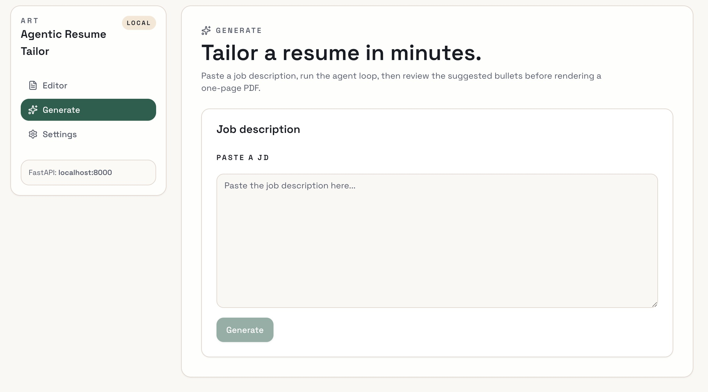

# Agentic Resume Tailor (ART)

Local-first resume tailoring system with a React (Vite) UI and a FastAPI backend. Your profile lives in a SQLite database, retrieval runs against a ChromaDB vector store (RAG-style), and the agent loop iterates Query → Rewrite → Score until it meets the target quality threshold.



For internal design details, see [ARCHITECTURE.md](ARCHITECTURE.md).

## What it does

- Store and edit your resume profile via DB-backed CRUD APIs used by the React UI.
- Generate a tailored single-page PDF + TeX + `report.json` for any job description.
- Run a 3-agent loop (Query → Rewrite → Score) that iterates until score ≥ threshold or `max_iters` is reached.
- Choose a rewrite style: **conservative** (default) keeps wording close to the original; **creative** allows stronger framing without adding new facts.
- View per-run explainability: semantic feedback, missing keywords, and rewrite audit trail.
- Re-render the PDF at any time after manually tweaking bullet selections.

## Repo map

```
├── backend/
│   ├── config/          # canonicalization.json, families.json, user_settings.json
│   ├── data/            # exported JSON (backup) + SQLite DB
│   ├── output/          # generated artifacts (<run_id>.pdf, .tex, _report.json)
│   ├── src/agentic_resume_tailor/
│   │   ├── api/         # FastAPI app, routes, runtime state
│   │   ├── core/
│   │   │   ├── agents/  # query_agent, rewrite_agent, scoring_agent, llm_client
│   │   │   ├── prompts/ # versioned prompt builders (query_v2, rewrite_v2, scoring_v2)
│   │   │   ├── artifacts.py        # unified artifact pipeline
│   │   │   └── loop_controller.py  # agent loop orchestration
│   │   ├── db/          # SQLAlchemy models, session, sync helpers
│   │   └── settings.py  # Pydantic settings with live_fields / restart_required_fields
│   ├── templates/       # LaTeX resume templates
│   └── tests/           # unit + characterization tests
└── frontend/
    └── src/
        ├── pages/       # EditorPage, GeneratePage, SettingsPage
        ├── components/  # ExperienceCard, ProjectCard, EducationCard, SortableBullet
        └── lib/         # api.ts (typed API client), utils.ts
```

## Quickstart

### Docker Compose (recommended)

```bash
docker compose up
```

- UI: `http://localhost:5173`
- API: `http://localhost:8000`
- The frontend container reaches the backend at `http://api:8000` via the internal Docker network. The browser still accesses the UI at `localhost:5173`.

> **First run:** the Chroma vector store starts empty. Run ingest after loading your profile data (see below).

### Local development

**Backend:**

```bash
cd backend
uv venv
source .venv/bin/activate
uv pip install -r requirements.txt
PYTHONPATH=src uv run python -m agentic_resume_tailor.api.server
```

**Frontend:**

```bash
cd frontend
npm install
npm run dev
```

- UI: `http://localhost:5173`
- API: `http://localhost:8000`
- The UI reads `VITE_API_URL` (defaults to `http://localhost:8000`).
- If you enable LLM agents, set `OPENAI_API_KEY` in `backend/.env` or your shell.

## Ingest

Ingest is an explicit action that rebuilds the Chroma retrieval index from the SQLite database. Run this after editing profile data.

```bash
# Local
cd backend
PYTHONPATH=src uv run python -m agentic_resume_tailor.ingest

# Docker Compose
docker compose run --rm api python -m agentic_resume_tailor.ingest
```

API shortcut: `POST /admin/ingest`  
Enable automatic re-ingest on profile save: `auto_reingest_on_save = true` in Settings.

## API reference

| Method | Path | Notes |
|--------|------|-------|
| `GET` | `/health` | Liveness check |
| `GET` / `PUT` | `/settings` | Includes `live_fields` and `restart_required_fields` metadata |
| CRUD | `/personal_info`, `/skills`, `/education`, `/experiences`, `/projects` | Profile CRUD |
| `POST` | `/admin/export` | Export DB → JSON (optional `?reingest=true`) |
| `POST` | `/admin/ingest` | Rebuild Chroma from exported JSON |
| `POST` | `/generate` | Run agent loop; accepts optional `rewrite_style` (`"conservative"` \| `"creative"`) and `run_id` |
| `POST` | `/runs/{run_id}/render` | Re-render PDF from a revised bullet selection |
| `GET` | `/runs/{run_id}/events` | SSE stream for real-time loop progress |
| `GET` | `/runs/{run_id}/pdf` | Download final PDF |
| `GET` | `/runs/{run_id}/tex` | Download LaTeX source |
| `GET` | `/runs/{run_id}/report` | Download `report.json` |

## Key settings

| Setting | Default | Effect |
|---------|---------|--------|
| `rewrite_style` | `conservative` | `conservative` or `creative` rewrite mode |
| `enable_bullet_rewrite` | `true` | Toggle LLM bullet rewriting |
| `use_jd_parser` | `true` | Use OpenAI Query Agent (requires `OPENAI_API_KEY`) |
| `jd_model` | `gpt-5.4-nano` | Model for Query/Rewrite/Scoring agents |
| `max_iters` | `3` | Agent loop iteration cap |
| `threshold` | `80` | Score target (0-100) for early stop |
| `skip_pdf` | `false` | Write TeX only; skip Tectonic rendering |
| `auto_reingest_on_save` | `false` | Auto-rebuild Chroma on profile save |

Settings marked **Live** apply immediately. Settings marked **Restart** require restarting the API server (e.g., `embed_model`, `db_path`, `collection_name`).

## Tests

```bash
cd backend
uv run pytest
```

45 unit tests + characterization tests covering: loop controller, rewrite agent, scoring agent, query agent fallback, LLM client, generate endpoint, and keyword matching.

## Troubleshooting

| Problem | Fix |
|---------|-----|
| UI cannot reach API | Confirm `VITE_API_URL` and CORS origins in Settings |
| "0 records in Chroma" | Run ingest to rebuild the vector store |
| PDF/TeX errors | Install Tectonic or set `skip_pdf = true` in Settings |
| `docker compose up` blob I/O error | Run `docker builder prune -a -f && docker compose build --no-cache` |
| LLM agents not running | Set `OPENAI_API_KEY` in `backend/.env` |
